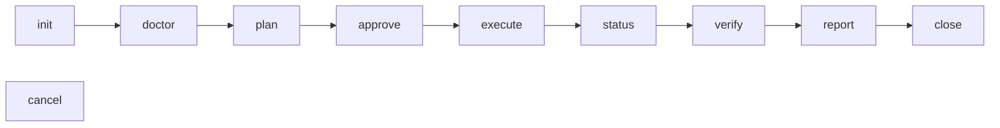

# Migmate

Finite, one-way movement or preservation of organizational content. The authoritative source is never modified, and every job leaves durable evidence of what was planned, processed, and verified.

Two job types:

- **File migration** — SharePoint document library to a Google Shared Drive folder.
- **Teams archive** — Microsoft Teams conversations to a local, offline HTML + JSONL package, optionally retained as conversation ZIPs in a Google Shared Drive folder.

`CONTEXT.md` is the glossary. It is the authority on what each term means; this README assumes it.

## Status

Pre-release, and **not published to any registry** — there is no publish workflow, so merging to `main` does not release. Install from source.

Only **three exact routes are qualified**, all on `darwin-arm64`: file migration, local Teams archive, and Teams archive with a Shared Drive destination. A route is a full tuple: source system, backend, permissions, options, destination, transfer binary version, and desktop cell. Change an element outside those tuples — including turning on an archive option — and it has no evidence, which the engine refuses with `unqualified_route` (exit 4). This is a deliberate gate, not a bug. `docs/release-limits.md` states what is and is not claimed; `qualification/gates.json` is the gate register.

## Requirements

- **Node 24.15.0 or later.** Not a taste preference: the durable store is `node:sqlite`, which is a release candidate rather than a stable API, and `24.15.0` is where it reached that tier — earlier 24.x carries a weaker one. Migmate therefore claims only the majors it has actually tested, and a command on any other runtime refuses with `usage` (exit 4 is for gates; this is exit 2) instead of reaching the store. `migmate --help` still answers anywhere, so an operator can read the requirement off the tool.
- **macOS 13.5+ or Linux**, on x64 or arm64. Any other platform is refused at install time by the `os` field, and `defaultHome` refuses it at runtime. Windows was removed deliberately — see `docs/adr/0002-drop-windows.md`.
- A desktop session only for `migmate web`, which opens a native WebView rather than serving a port.

`rclone` is vendored and checksum-pinned in the artifact. Do not install it separately.

Both version pins live in `src/versions.ts`, which explains why each is narrow and is the only place to widen either.

## Install

```sh
git clone git@github.com:devosurf/migmate-cli.git
cd migmate-cli
npm ci
npm pack                                   # prepack builds and verifies the vendored binaries
npm install -g ./devosurf-migmate-0.1.0-dev.tgz
migmate --help
```

`npm pack` produces a ~348 MB tarball; most of it is the four vendored `rclone` builds, which ship so that a transfer never depends on an unpinned binary.

To work in the repo without installing globally, `node dist/cli/main.js` after `npm run build` is equivalent to the `migmate` bin.

## The lifecycle

Ten verbs on one rail, in this order:



`init` creates the job; `creds init` onboards an operator config onto it. `doctor` runs preflight — the checks only an administrator can satisfy, which refuse rather than retry. `plan` produces an immutable digest-bound proposal. `approve` binds an identity to that exact digest. `execute` does the work. `verify` compares the destination against the plan and raises findings; `accept` records an operator's acknowledgement of a finding as an exception, which never disappears from a report. `close` is terminal, and refuses while any finding is unaccepted.

A minimal file-migration run:

```sh
migmate init --type file_migration --output json          # -> job id
migmate creds init --job "$ID" --config job.toml
migmate doctor --job "$ID" --output json
migmate plan   --job "$ID" --output json                  # -> planDigest
migmate approve --job "$ID" --approver "you@example.com" \
  --plan-digest "$DIGEST" --output json
migmate execute --job "$ID" --output json
migmate verify  --job "$ID" --output json
migmate report  --job "$ID" --output json
migmate close   --job "$ID" --output json
```

Read `plan` and `verify` evidence without taking a writer lease by adding `--review`. Only one writer holds a job at a time; a stale lease is cleared with `reclaim --confirm`, never by deleting files.

## Credentials

Operator config carries **credential references** — typed pointers to operator-owned files — never secret values. Migmate resolves a reference just in time and never copies the bytes into durable state. Reference files must be `0600` and owned by the invoking user, outside the repository; the qualification runner refuses anything looser.

`scripts/stage1-prereqs.sh` (file route) and `scripts/archive-prereqs.sh` (archive route) are interactive wizards that walk the tenant setup a human has to do, and write those files. Both take `--resume <env-file>` to re-emit config without walking the tenant again.

Teams archive config can also name an optional Google Shared Drive destination. Add these
tables alongside the existing archive scopes, `graph` settings, and
`secrets.teams_graph_client_secret` reference:

```toml
[destination]
destDriveId = "0ABCsharedDrive"
destFolderId = "1XYZarchiveFolder"

[secrets.google_service_account]
resolver = "file"
path = "/absolute/path/to/service-account.json"
mode = "0600"
```

Both destination fields are stable IDs, not display names, paths, or the `root` alias.
The Google service-account JSON stays in an operator-owned file outside the job folder;
it is a separate credential, not an extra Graph role. A configured destination requires
this reference when onboarding credentials. Omit both tables for the existing local-only
archive.

The archive driver self-verifies the local package before building deterministic ZIPs
and uploading anything from the package. The destination folder receives `index.html`,
`index.csv`, and `manifest.json` as ordinary files, plus `<conversation-directory>.zip`
for each conversation. Use the exposed `index.csv` to find a conversation, download its
ZIP, and extract it locally. The local package remains the authority.

Uploads are create-only, with durable reserved IDs and private provenance markers.
Interrupted execution resumes without duplicating completed objects. Same-name unproven
objects are retained and reported, never overwritten. Verification checks destination
bytes and revision tokens without querying Graph; Drive permissions, not local read-only
modes, protect the retained copy.

**This destination is qualified on `darwin-arm64`, with all three archive options off.**
Its own live evidence bundle proves download byte verification, lost-acknowledgement
recovery, unchanged replay, and deterministic containers regenerated from the live package.
The destination-free tuple and its published bundle remain unchanged.
See [ADR-0008](docs/adr/0008-archive-cold-storage-destination.md).

## Driving it from an agent or CI

Every command takes `--output text|json|jsonl` and answers with a versioned envelope, so nothing needs screen-scraping:

```json
{
  "schemaVersion": 1,
  "command": "init",
  "commandId": "725f0755-…",
  "job": { "id": "841ffee2-…", "type": "file_migration" },
  "ok": true,
  "value": { "id": "841ffee2-…" }
}
```

`ok: false` replaces `value` with `refusal`, carrying a stable `code` — branch on that code and on the exit status, not on message text. Refusal envelopes go to stderr. `--output jsonl` streams durable events live during a verb, and `--from CURSOR` resumes exclusively; `status --output jsonl` replays the log and exits rather than watching.

Exit codes are meaningful: `0` success, `2` usage or configuration, `3` lease or recovery refusal, `4` a preflight, approval, route, or verification gate, `5` blocked at a checkpoint, `6`/`7` already closed or cancelled. `migmate --help` is the full reference for flags, row-query options, and the complete exit table — it is kept accurate, so read it rather than trusting a copy.

Machine approval always requires both an explicit `--approver` identity and the read-back plan digest. Only fully-TTY text mode may prompt, and it has no default answer, so an agent can never approve a plan by accident.

Agents working in this repo have a skill at `.agents/skills/migmate/SKILL.md`, discovered automatically from a clone.

## Development

`package.json` holds the scripts; the ones with non-obvious cost:

- `npm test` — behavioural suites, no network.
- `npm run check:vendor` — verifies the vendored binary hashes.
- `npm run check:worker` — opt-in, spawns the real `rclone` worker.
- `npm run check:package` — packs, installs globally into a temporary prefix, and smoke-tests the installed artifact. This is what CI's four cells run.
- `npm run qualify:route` — the live gate. Needs real tenant prerequisites and a supported Node, and blocks with `node_runtime_unsupported` otherwise; `--output` must be a new directory outside the repo.

Published bundles are written `0444`/`0555`, so `chmod -R u+w` before removing an evidence directory.

## Where to look next

| Question                              | File                        |
| ------------------------------------- | --------------------------- |
| What does this term mean?             | `CONTEXT.md`                |
| Why is it built this way?             | `docs/adr/`                 |
| What does the release actually claim? | `docs/release-limits.md`    |
| Which gates passed, and where?        | `qualification/gates.json`  |
| How do agents work in this repo?      | `AGENTS.md`, `docs/agents/` |
