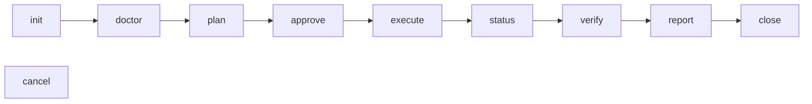

# Migmate

Finite, one-way movement or preservation of organizational content. The authoritative source is never modified, and every job leaves durable evidence of what was planned, processed, and verified.

Two job types:

- **File migration** — SharePoint document library to a Google Shared Drive folder.
- **Teams archive** — Microsoft Teams conversations to a local, offline HTML + JSONL package, optionally retained as conversation ZIPs in a Google Shared Drive folder.

`CONTEXT.md` is the glossary. It is the authority on what each term means; this README assumes it.

## Status

Pre-release. Releases are GitHub Releases cut from `v*` tags by `.github/workflows/release.yml`; nothing is published to npm, and merging to `main` does not release.

Two job types: file migration, and Teams archive with or without a Shared Drive destination. Archives support `retainedHistory`, `transcripts`, and `attachmentBytes`. File migrations execute rclone copy passes and verify relative file paths by hash (or explicitly selected size-only proof); archives verify their local package and any uploaded copy. Blocking findings require acceptance before `close`. There is no per-route evidence gate ([ADR-0009](docs/adr/0009-per-job-verification-replaces-route-qualification.md)), so supported configurations run on all four platforms. Unsupported shapes refuse with `unsupported_route` (exit 4). Historical live observations and their limits are recorded in `docs/release-limits.md`; they do not prove the new rclone-executed file route.

## Requirements

- **Node 24.15.0 or later**, any later major included; the [installer](#install) supplies a private one when the host's is missing or older. The floor is not a taste preference: the durable store is `node:sqlite`, which is a release candidate rather than a stable API, and `24.15.0` is where it reached that tier — earlier 24.x carries a weaker one. An earlier runtime is refused as `usage` (exit 4 is for gates; this is exit 2) instead of reaching the store. `migmate --help` still answers anywhere, so an operator can read the requirement off the tool.
- **macOS 13.5+ or Linux**, on x64 or arm64. Any other platform is refused at install time by the `os` field, and `defaultHome` refuses it at runtime. Windows was removed deliberately — see `docs/adr/0002-drop-windows.md`.
- A desktop session only for `migmate web`, which opens a native WebView rather than serving a port.

`rclone` is vendored and checksum-pinned in the artifact. Do not install it separately.

Both version requirements live in `src/versions.ts`: an open Node floor, and an exact transfer binary pin whose narrowness that file explains and where widening it is decided. `package.json`'s `engines` mirrors the same Node floor for npm's benefit.

## Install

```sh
curl -fsSL https://github.com/devosurf/migmate-cli/releases/latest/download/install.sh | sh
```

The installer checks the platform, downloads the latest release (~117 MB, almost all of it the four vendored `rclone` builds) and verifies it against the release's `SHA256SUMS`, then writes a `migmate` launcher to `~/.local/bin`. It uses your `node` when it meets the release's Node floor and has npm beside it; otherwise it downloads a private Node from nodejs.org, checks it against nodejs.org's `SHASUMS256.txt`, and keeps it inside the install. It never edits shell startup files: when `~/.local/bin` is not on `PATH`, it prints the line to add.

Update with `migmate upgrade`, or run the same one-liner again. The previous version stays on disk until the next upgrade, so a job still running from it keeps its files.

| Setting                               | Default                      | Effect                                                             |
| ------------------------------------- | ---------------------------- | ------------------------------------------------------------------ |
| `--version X.Y.Z` / `MIGMATE_VERSION` | latest                       | Install or move to one release: `migmate upgrade --version X.Y.Z`  |
| `MIGMATE_INSTALL_DIR`                 | `~/.local/share/migmate-cli` | Installed versions, any private Node, and the `current` link       |
| `MIGMATE_BIN_DIR`                     | `~/.local/bin`               | Where the `migmate` launcher goes                                  |
| `MIGMATE_NODE`                        | `auto`                       | `system` insists on your Node; `bundled` always uses a private one |

Pass options through the pipe with `sh -s --`, for example `… | sh -s -- --version 0.1.0`. Uninstall with `rm -rf ~/.local/share/migmate-cli ~/.local/bin/migmate`; job stores live elsewhere and are left alone.

### From source

```sh
git clone https://github.com/devosurf/migmate-cli.git
cd migmate-cli
npm ci
npm pack                                   # prepack builds and verifies the vendored binaries
npm install -g ./devosurf-migmate-*.tgz
migmate --help
```

`npm pack` produces a ~117 MB tarball that unpacks to ~348 MB; almost all of it is the four vendored `rclone` builds, which ship so that a transfer never depends on an unpinned binary.

To work in the repo without installing globally, `node dist/cli/main.js` after `npm run build` is equivalent to the `migmate` bin.

## Folder-local workspaces

A workspace is an ordinary project folder with a private `.migmate/` job store inside it.
Initialize that store and its first job once:

```sh
mkdir -p -m 700 "$HOME/Migrations/essense"
cd "$HOME/Migrations/essense"
migmate init --type file_migration --home .migmate --output json
```

Keep the returned job ID. Subsequent commands find the nearest `.migmate/` directory in
the current folder or its parents, including from subfolders and new terminal sessions:

```sh
migmate status --job "$ID" --output json
```

You still select a job with `--job`; a workspace can contain multiple file-migration
and Teams-archive jobs. The first job above is unconfigured: onboard its credentials
before `doctor` or `plan`, as described below.

Home selection is **`--home` → `MIGMATE_HOME` → nearest `.migmate/` → OS default**.
An explicit relative home is relative to the current working directory. If you previously
exported `MIGMATE_HOME`, unset it before relying on folder discovery. Outside a workspace,
existing global defaults are unchanged; no existing job data is moved and merely entering
a folder creates nothing.

A file or symlink named `.migmate`, or an error inspecting it, refuses rather than silently
using a parent workspace or the global store. Use `--home` to select a different store
explicitly; `--help` remains available.

The `.migmate/` directory holds durable plans, checkpoints, reports and archive content.
Keep it and customer inputs out of source control; this repository ignores `.migmate/`.
Credential files remain protected outside the repository and job directories.

## The lifecycle

Ten verbs on one rail, in this order:



`init` creates the job; `creds init` onboards an operator config onto it. `doctor` runs preflight — the checks only an administrator can satisfy, which refuse rather than retry. `plan` produces an immutable digest-bound proposal. `approve` binds an identity to that exact digest. `execute` does the work. `verify` compares the destination against the plan and raises findings; `accept` records an operator's acknowledgement of a finding as an exception, which never disappears from a report. `close` is terminal, and refuses while any finding is unaccepted.

File-migration approval binds the destination root, not unrelated folder contents. A missing root or changed root identity, drive, or folder type still refuses; an excluded source subtree gaining a new member, or an approved excluded item moving outside that subtree within the mapping, requires replanning before any copy starts. Copies use rclone's path-based comparison: existing same-path content can be updated. **There is no file-level collision protection or compare-then-write guarantee.** Use dedicated destination roots and keep outside writers away during migration.

### File mapping copies and recovery

Keep the existing `[[mappings]]` job configuration. Each approved mapping runs sequentially through the managed rclone worker, with four transfers inside a pass. Destinations must already exist; this release adds no manifest loader, provisioning, mirror/delete mode, or mapping-concurrency setting.

`status` exposes durable `mappingPasses`: mapping and pass number, mode, rclone handle, state, timestamps, last stats and error. Failed mappings retain rclone's error while later mappings continue. Run `execute` again to retry failed or interrupted mappings; completed mappings in the approved revision are skipped. On writer-open recovery, an unfinished pass whose worker is gone becomes interrupted. A retried copy lets rclone skip identical files instead of recovering per-file uploads.

Ctrl-C stops active passes cooperatively, returns exit **130**, and leaves the job resumable. `execute --output jsonl` emits `mapping_progress` events with `mappingId`, `passNumber`, `bytes`, `files`, `speed`, and `errors`. These statistics describe copying; `verify` supplies the content proof.

The web view's **execute** and **status** stages show each mapping's pass number, state, bytes, files, speed, error count, and failure message. Pending passes show unknown statistics until rclone reports them; earlier attempts remain visible alongside resumed passes.

rclone copies empty folders and preserves supported created/modified times and Google Drive content type through metadata; created time on Drive applies to fresh uploads. Owner, permission and label metadata are off. SharePoint roots are paths inside a drive pinned by id, never SharePoint `root_folder_id`; per-mapping connection overrides reuse the operator's two remotes. Copy never deletes: renamed or removed source files can leave destination-only files, reported nonblockingly by verification.

File migration no longer stages file bytes locally or uses reserved destination IDs, private provenance markers, or move-by-id. Teams archive uploads retain their separate create-only protections.

A minimal file-migration run:

```sh
migmate init --type file_migration --output json          # -> job id
migmate creds init --job "$ID" --config job.toml
migmate doctor --job "$ID" --output json
migmate plan   --job "$ID" --output json                  # -> planDigest
migmate approve --job "$ID" --approver "you@example.com" \
  --plan-digest "$DIGEST" --output json
migmate execute --job "$ID" --output json
migmate verify  --job "$ID" --output json
migmate report  --job "$ID" --output json
migmate close   --job "$ID" --output json
```

Read `plan` and `verify` evidence without taking a writer lease by adding `--review`. Only one writer holds a job at a time. The next writer automatically takes over a crashed writer's same-host lease once its heartbeat is 30 seconds stale and its process and worker are gone, recording recovery in the job's events. Use `reclaim --job ID --confirm --stop-worker` to stop a recorded orphan worker; explicit `reclaim --confirm` remains available for recovery without opening a writer. Never delete lease files by hand.

In `migmate web`, tick the confirmation checkbox beside **Quit process safely**, then click the button to interrupt at a safe checkpoint and release the writer lease. This confirmation stays inside the page; it does not depend on a native JavaScript dialog. Closing only the window does not interrupt an active run.

## Credentials

Operator config carries **credential references** — typed pointers to operator-owned files — never secret values. Migmate resolves a reference just in time and never copies the bytes into durable state. Reference files must be regular files owned by the invoking user carrying no group or other permission bits — `0600`, or stricter — and live outside the repository; the engine and the live test runner both refuse anything looser.

`scripts/stage1-prereqs.sh` (file route) and `scripts/archive-prereqs.sh` (archive route) are interactive wizards that walk the tenant setup a human has to do, and write those files. Both take `--resume <env-file>` to re-emit config without walking the tenant again.

### Teams retained history

Retained history uses channel and user-chats scopes with `retainedHistory = true`.
`transcripts` and `attachmentBytes` can also be enabled, subject to their permission and tenant checks.

Private channels are collected too. Their retained versions are available only for
edits/deletions after tenant storage migration completed and when an applicable retention
policy captured them. An empty response is not proof of full historical coverage, and a
missing migration completion timestamp remains unknown. See [release limits](docs/release-limits.md#5-supported-routes-and-every-job-verifies-itself)
for the live sample and option prerequisites.

### Teams archive destination

Teams archive config can also name an optional Google Shared Drive destination. Add these
tables alongside the existing archive scopes, `graph` settings, and
`secrets.teams_graph_client_secret` reference:

```toml
[destination]
destDriveId = "0ABCsharedDrive"
destFolderId = "1XYZarchiveFolder"

[secrets.google_service_account]
resolver = "file"
path = "/absolute/path/to/service-account.json"
mode = "0600"
```

Both destination fields are stable IDs, not display names, paths, or the `root` alias.
The Google service-account JSON stays in an operator-owned file outside the job folder;
it is a separate credential, not an extra Graph role. A configured destination requires
this reference when onboarding credentials. Omit both tables for the existing local-only
archive.

The archive driver self-verifies the local package before building deterministic ZIPs
and uploading anything from the package. The destination folder receives `index.html`,
`index.csv`, and `manifest.json` as ordinary files, plus `<conversation-directory>.zip`
for each conversation. This is **cold storage, not a reading surface**: Drive's web UI
cannot render the HTML archive. Use the exposed `index.csv` to find a conversation,
download its ZIP, and extract it locally to open its `index.html`. The local package
remains the authority and the complete offline reading surface.

Uploads are create-only, with durable reserved IDs and private provenance markers.
Interrupted execution resumes without duplicating completed objects. Same-name unproven
objects are retained and reported, never overwritten. Verification checks destination
bytes and revision tokens without querying Graph. Drive has no POSIX modes: the ZIP's
`0444`/`0555` entry modes do not protect the uploaded objects. Immutability at rest
depends on operator-managed Drive permissions.

One ZIP per conversation keeps the payload to `N + 3` objects for `N` conversations
and permits targeted retrieval without downloading the entire archive. The
500,000-item budget applies across the shared drive, including folders and trash,
not separately to each job. See [archive destination limits](docs/release-limits.md#6-the-archive-destination-is-cold-storage-not-a-reading-surface)
for the capacity accounting and protection boundary.

**The destination supports `retainedHistory`, `transcripts`, and `attachmentBytes`.**
The last retained-destination live test proved that current and retained
edited-text versions survive download and extraction into canonical records and offline
HTML. It also proved download byte verification, lost-acknowledgement recovery, unchanged
replay, timestamp-independent ZIPs, and refusal to overwrite unowned or drifted content.
The private-history limits above still apply; nothing proves deleted-message recovery or
retained hosted-content availability. See [ADR-0008](docs/adr/0008-archive-cold-storage-destination.md).

## Driving it from an agent or CI

Every command takes `--output text|json|jsonl` and answers with a versioned envelope, so nothing needs screen-scraping:

```json
{
  "schemaVersion": 1,
  "command": "init",
  "commandId": "725f0755-…",
  "job": { "id": "841ffee2-…", "type": "file_migration" },
  "ok": true,
  "value": { "id": "841ffee2-…" }
}
```

`ok: false` replaces `value` with `refusal`, carrying a stable `code` — branch on that code and on the exit status, not on message text. In `json` and `jsonl` a refusal is written to stdout like any other envelope; only text mode sends one to stderr. `--output jsonl` streams durable events live during a verb, and `--from CURSOR` resumes exclusively; `status --output jsonl` replays the log and exits rather than watching.

Exit codes are meaningful: `0` success, `1` internal defect or an unmappable code, `2` usage or configuration, `3` lease or recovery refusal, `4` a preflight, approval, route, or verification gate, `5` blocked at a checkpoint, `6`/`7` already closed or cancelled, `8` durable state written by a newer build; `130`, `141` and `143` are interrupt, broken stdout and terminate. `migmate --help` is the full reference for flags, row-query options, and the complete exit table — it is kept accurate, so read it rather than trusting a copy.

Machine approval always requires both an explicit `--approver` identity and the read-back plan digest. Text mode prompts only when stdin and stderr are terminals and those two flags were not both given; the prompt has no default answer and accepts only `yes`, so an agent can never approve a plan by accident.

Agents working in this repo have a skill at `.agents/skills/migmate/SKILL.md`, discovered automatically from a clone.

## Development

`package.json` holds the scripts; the ones with non-obvious cost:

- `npm test` — behavioural suites, no network.
- `npm run check:vendor` — verifies the vendored binary hashes.
- `npm run check:worker` — opt-in locally, required in CI's four platform cells. Spawns the vendored `rclone` worker and proves authentication, lifecycle, asynchronous copy, per-pass status/stats, cooperative stop and resumable copy, capped mirror deletions, and stored/downloaded hash listings against disposable local folders.
- `npm run check:package` — packs, installs globally into a temporary prefix, and smoke-tests the installed artifact. This is what CI's four cells run.
- `npm run check:install` — packs, serves the artifact as a local GitHub-shaped release, and drives `scripts/install.sh` through a fresh install, `migmate upgrade`, pruning, a tampered checksum, and a private Node download from nodejs.org. CI's four cells run it after `check:package`.
- `npm run test:live -- --config <file>` — optional and credentialed. File probes use disposable mapping roots through the production engine for multi-mapping rclone copies, hash verification, cooperative interruption/reopen/resume, completed-pass skips, and source capability samples. An interruption that finishes too quickly is not claimed as proven. Archive probes remain separate. The wizards write its config, described by `scripts/live/config.schema.json`; it is not part of `npm test`, CI, or a release gate.

The real-binary suites are skipped by ordinary `npm test`. To run the copy-pass suite alone, supply `MIGMATE_TEST_RCLONE_BINARY` (path), `MIGMATE_TEST_RCLONE_SHA256`, and `MIGMATE_TEST_RCLONE_PROVENANCE`, then run `node --test src/engine/providers/copy-pass.test.ts`; `npm run check:worker` resolves these from the vendored manifest automatically. The hash test also uses an encrypted local-folder remote to prove downloading a hash the remote cannot supply.

**Releasing.** Set `version` in `package.json`, commit, then push a matching tag (`git tag v0.1.0 && git push origin v0.1.0`). `.github/workflows/release.yml` reruns CI on all four cells and publishes `migmate-<version>.tgz`, `install.sh`, and `SHA256SUMS` as a GitHub release. A version with a `-` suffix is marked prerelease, which `latest` and `migmate upgrade` skip.

## Where to look next

| Question                              | File                        |
| ------------------------------------- | --------------------------- |
| What does this term mean?             | `CONTEXT.md`                |
| Why is it built this way?             | `docs/adr/`                 |
| What does the release actually claim? | `docs/release-limits.md`    |
| How do agents work in this repo?      | `AGENTS.md`, `docs/agents/` |
