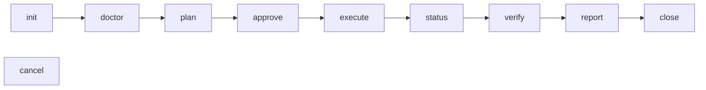

# Migmate

Finite, one-way movement or preservation of organizational content. The authoritative source is never modified, and every job leaves durable evidence of what was planned, processed, and verified.

Two job types:

- **File migration** — SharePoint document library to a Google Shared Drive folder, and Google Shared Drive folder to an existing SharePoint document library or folder.
- **Teams archive** — Microsoft Teams conversations to a local, offline HTML + JSONL package, optionally retained as conversation ZIPs in a Google Shared Drive folder.

`CONTEXT.md` is the glossary. It is the authority on what each term means; this README assumes it.

## Status

Pre-release. Releases are GitHub Releases cut from `v*` tags by `.github/workflows/release.yml`; nothing is published to npm, and merging to `main` does not release.

Two job types: file migration, and Teams archive with or without a Shared Drive destination. Archives support `retainedHistory`, `transcripts`, and `attachmentBytes`. File migrations execute rclone copy passes and verify relative file paths by hash (or explicitly selected size-only proof); archives verify their local package and any uploaded copy. Blocking findings require acceptance before `close`. There is no per-route evidence gate ([ADR-0009](docs/adr/0009-per-job-verification-replaces-route-qualification.md)), so supported configurations run on all four platforms. Unsupported shapes refuse with `unsupported_route` (exit 4). Historical live observations and their limits are recorded in `docs/release-limits.md`; they do not prove the new rclone-executed file route.

## Requirements

- **Node 24.15.0 or later**, any later major included; the [installer](#install) supplies a private one when the host's is missing or older. The floor is not a taste preference: the durable store is `node:sqlite`, which is a release candidate rather than a stable API, and `24.15.0` is where it reached that tier — earlier 24.x carries a weaker one. An earlier runtime is refused as `usage` (exit 4 is for gates; this is exit 2) instead of reaching the store. `migmate --help` still answers anywhere, so an operator can read the requirement off the tool.
- **macOS 13.5+ or Linux**, on x64 or arm64. Any other platform is refused at install time by the `os` field, and `defaultHome` refuses it at runtime. Windows was removed deliberately — see `docs/adr/0002-drop-windows.md`.
- A desktop session only for `migmate web`, which opens a native WebView rather than serving a port.

`rclone` is vendored and checksum-pinned in the artifact. Do not install it separately.

Both version requirements live in `src/versions.ts`: an open Node floor, and an exact transfer binary pin whose narrowness that file explains and where widening it is decided. `package.json`'s `engines` mirrors the same Node floor for npm's benefit.

## Install

```sh
curl -fsSL https://github.com/devosurf/migmate-cli/releases/latest/download/install.sh | sh
```

The installer checks the platform, downloads the latest release (~117 MB, almost all of it the four vendored `rclone` builds) and verifies it against the release's `SHA256SUMS`, then writes a `migmate` launcher to `~/.local/bin`. It uses your `node` when it meets the release's Node floor and has npm beside it; otherwise it downloads a private Node from nodejs.org, checks it against nodejs.org's `SHASUMS256.txt`, and keeps it inside the install. It never edits shell startup files: when `~/.local/bin` is not on `PATH`, it prints the line to add.

Update with `migmate upgrade`, or run the same one-liner again. The previous version stays on disk until the next upgrade, so a job still running from it keeps its files.

| Setting                               | Default                      | Effect                                                             |
| ------------------------------------- | ---------------------------- | ------------------------------------------------------------------ |
| `--version X.Y.Z` / `MIGMATE_VERSION` | latest                       | Install or move to one release: `migmate upgrade --version X.Y.Z`  |
| `MIGMATE_INSTALL_DIR`                 | `~/.local/share/migmate-cli` | Installed versions, any private Node, and the `current` link       |
| `MIGMATE_BIN_DIR`                     | `~/.local/bin`               | Where the `migmate` launcher goes                                  |
| `MIGMATE_NODE`                        | `auto`                       | `system` insists on your Node; `bundled` always uses a private one |

Pass options through the pipe with `sh -s --`, for example `… | sh -s -- --version 0.1.0`. Uninstall with `rm -rf ~/.local/share/migmate-cli ~/.local/bin/migmate`; job stores live elsewhere and are left alone.

### From source

```sh
git clone https://github.com/devosurf/migmate-cli.git
cd migmate-cli
npm ci
npm pack                                   # prepack builds and verifies the vendored binaries
npm install -g ./devosurf-migmate-*.tgz
migmate --help
```

`npm pack` produces a ~117 MB tarball that unpacks to ~348 MB; almost all of it is the four vendored `rclone` builds, which ship so that a transfer never depends on an unpinned binary.

To work in the repo without installing globally, `node dist/cli/main.js` after `npm run build` is equivalent to the `migmate` bin.

## Folder-local workspaces

A workspace is an ordinary project folder with a private `.migmate/` job store inside it.
Initialize that store and its first job once:

```sh
mkdir -p -m 700 "$HOME/Migrations/essense"
cd "$HOME/Migrations/essense"
migmate init --type file_migration --home .migmate --output json
```

Keep the returned job ID. Subsequent commands find the nearest `.migmate/` directory in
the current folder or its parents, including from subfolders and new terminal sessions:

```sh
migmate status --job "$ID" --output json
```

You still select a job with `--job`; a workspace can contain multiple file-migration
and Teams-archive jobs. The first job above is unconfigured: onboard its credentials
before `doctor` or `plan`, as described below.

Home selection is **`--home` → `MIGMATE_HOME` → nearest `.migmate/` → OS default**.
An explicit relative home is relative to the current working directory. If you previously
exported `MIGMATE_HOME`, unset it before relying on folder discovery. Outside a workspace,
existing global defaults are unchanged; no existing job data is moved and merely entering
a folder creates nothing.

A file or symlink named `.migmate`, or an error inspecting it, refuses rather than silently
using a parent workspace or the global store. Use `--home` to select a different store
explicitly; `--help` remains available.

The `.migmate/` directory holds durable plans, checkpoints, reports and archive content.
Keep it and customer inputs out of source control; this repository ignores `.migmate/`.
Credential files remain protected outside the repository and job directories.

## The lifecycle

Ten verbs on one rail, in this order:



`init` creates the job; `creds init` onboards an operator config onto it. `doctor` runs preflight — the checks only an administrator can satisfy, which refuse rather than retry. `plan` produces an immutable digest-bound proposal. `approve` binds an identity to that exact digest. `execute` does the work. `verify` compares the destination against the plan and raises findings; `accept` records an operator's acknowledgement of a finding as an exception, which never disappears from a report. `close` is terminal, and refuses while any blocking finding is unaccepted. With deferred member grants, confirming `close` also authorizes go-live.

For file verification, a source that changed between copy and verify can raise three findings for one path: `source_size_inconsistent`, `size_mismatch`, and `content_mismatch`. `sourceSize` reports the size actually compared with `destinationSize`; when the listing contradicts served bytes, `listedSize` preserves the listing and the inconsistency finding also carries `servedSize`. The dependent size and content findings carry `cause: "source_size_inconsistent"` so they can be reviewed together. All three still block `close` until explicitly accepted; accepting the cause alone does not accept the other findings.

File-migration approval binds the destination root, not unrelated folder contents. A missing root or changed root identity, drive, or folder type still refuses; an excluded source subtree gaining a new member, or an approved excluded item moving outside that subtree within the mapping, requires replanning before any copy starts. Copies use rclone's path-based comparison: existing same-path content can be updated. **There is no file-level collision protection or compare-then-write guarantee.** Use dedicated destination roots and keep outside writers away during migration.

### Acting Google account

File jobs optionally enable domain-wide delegation with top-level job TOML settings
(before any table header):

```toml
impersonate = true
subject = "files@example.com"
```

With impersonation omitted or `false`, the service account acts as itself.
For delegation, a Workspace administrator authorizes the service account's **numeric
client id** (from its JSON key, not its email) with only
`https://www.googleapis.com/auth/drive`. Choose an ordinary **non-admin subject**
and give that account access to each destination. Migmate cannot check admin status
without Admin SDK scopes and never requests them; checking it is the operator's responsibility.
Delegation is a domain-wide key, not access limited to the named subject.

Preflight proves Google issues a subject token and `about.user.emailAddress` equals
the configured subject; failures name the delegation fix. Migmate requests only the
Drive scope and injects `impersonate` into each mapping's rclone connection string.
Keep `impersonate` out of the operator's rclone config: its strict allowlist refuses it.
Plan and report show the acting account. The closing report leaves deleting the
service-account key and deleting the delegation entry as open operator tasks;
Migmate does not perform those administrative deletions. A manifest that creates
Shared Drives also requires `about.canCreateDrives = true` in preflight.

### Mapping manifests

Load a batch with `migmate manifest load --job "$ID" --file mappings.json --output json`.
Configure the job's credential references first (`init --config job.toml` or
`creds init --job "$ID" --config job.toml`). The config may omit `[[mappings]]`;
credential onboarding and `doctor` work before the manifest exists. Load resolves
source paths and both trees' ancestry through the providers. Until mappings are
loaded, `plan` refuses `configuration_invalid` (exit 2), with `detail.field: "mappings"`
and guidance to run `manifest load`. JSON is authoritative:

```json
{
  "version": 1,
  "mappings": [
    {
      "id": "finance",
      "source": {
        "type": "sharepoint",
        "driveId": "sharepoint-library-id",
        "folderPath": "Reports/2026"
      },
      "destination": {
        "type": "google_shared_drive",
        "driveId": "shared-drive-id",
        "folderId": "existing-folder-id"
      }
    }
  ]
}
```

`folderPath` is a literal, unescaped path relative to the SharePoint drive root;
`""` selects the whole library. Use `/` between segments, without leading/trailing
slashes, empty segments, `.` or `..`. IDs are stable provider IDs, not URLs or the
alias `root`; mapping IDs must be unique. Both roots must be ordinary folders.
Mappings overlap if their source roots in the same drive are equal or one is an
ancestor of the other, **or** their destination roots in the same Shared Drive are
equal or nested. Sibling trees are allowed; exclusions do not make overlapping roots safe.

For a new Shared Drive, replace `destination` with
`{ "type": "google_shared_drive", "create": "Finance" }` and optionally add
`members` beside `source` and `destination`:

```json
{
  "members": [
    { "email": "finance@example.com", "type": "group", "role": "fileOrganizer" },
    { "email": "reviewer@example.com", "type": "user", "role": "reader" }
  ]
}
```

The drive root becomes the destination folder. Existing destinations and drives
to create may coexist in one manifest. Members apply only to drives the job
creates; types are `user` or `group`, and roles are `organizer`, `fileOrganizer`,
`writer`, `commenter`, or `reader`. `anyone` and `domain` refuse at load, naming
the row and `members.N.type`. Emails are case-insensitive and duplicates refuse.

**Member grant timing.**

File jobs bind `[options] memberGrants` into the approved plan. Unstaged jobs
default to `"before_copy"` (unchanged); staged jobs default to
`"after_verification"`. Either default can be explicitly overridden:

```toml
[options]
staged = true
memberGrants = "after_verification" # or "before_copy"
```

Plan and report disclose the effective mode beside Mirror and Copy concurrency.
With `before_copy`, execute creates drives and grants manifest members before
copying. With `after_verification`, execute creates drives and copies without
granting manifest members; `status.memberGrants` stays empty through execution.
A verified prestage or intermediate delta does not grant access.

Verify, review the pre-close report, and explicitly accept any blocking findings
before confirming `close`. For staged jobs, the latest revision must also be final,
settled and fully verified. Close is the go-live authorization: it durably fences
further copy/mirror work for each affected drive **before the first grant request**,
grants the approved members, checks membership and destination-content/permission
drift, and writes timestamped grant evidence and the final report before closing.

If close fails or is interrupted, repeat `close` to resume grants, checks and
reporting, not transfers. **Some access may already exist after a failed close.**
Resolve membership or destination drift manually; another copy/mirror pass against
an affected drive is not a recovery path. Go-live is not successful until its
post-grant checks pass.
`execute` against a fenced drive refuses `go_live_started` (exit 4). The short
destination drift check compares file paths, sizes, stored hashes and IDs plus
folder paths with verification; it is not another content download or a guarantee
against later writes. Its permission check covers explicit drive membership, not
inherited permissions or effective group membership.

In either mode, plan/report warn that mirror can overwrite or delete existing
writers' files. Deferring manifest grants does not revoke or exclude external
access, administrators, existing drive members or members of pre-populated groups.
The acting account needs organizer access; restricting other access is an operator
precondition, not a Migmate isolation guarantee.

For existing destinations, CSV accepts this exact seven-column header:

```csv
id,source.type,source.driveId,source.folderPath,destination.type,destination.driveId,destination.folderId
finance,sharepoint,sharepoint-library-id,Reports/2026,google_shared_drive,shared-drive-id,existing-folder-id
```

For provisioning, use the exact nine-column layout below. Leave existing
destination IDs empty when `destination.create` is set; the `members` cell is
a JSON array encoded as a CSV string. Leave the two added cells empty for existing
destinations in a mixed manifest.

```csv
id,source.type,source.driveId,source.folderPath,destination.type,destination.driveId,destination.folderId,destination.create,members
finance,sharepoint,sharepoint-library-id,Reports/2026,google_shared_drive,,,Finance,"[{""email"":""finance@example.com"",""type"":""group"",""role"":""writer""}]"
```

Use UTF-8 and standard double-quoted CSV cells (double a quote inside a quoted cell);
LF and CRLF are accepted. An empty source path is an empty cell. Validation refuses
with `configuration_invalid` (exit 2), `refusal.detail.row` (one-based mapping/data
record; 0 means document/header), and `refusal.detail.field`. JSON fields and CSV
columns are strict: every unknown field refuses rather than being ignored.

A successful load replaces the entire mapping set in SQLite, not the credential
settings. Legacy `[[mappings]]` configs move into SQLite on writer open, preserving
stable IDs and exclusions; mappings no longer remain in `job.toml`. The plan freezes
the resolved mappings and `manifestDigest` (SHA-256 of canonical versioned JSON,
ordered by mapping ID). Editing the input file has no effect until another load.
Loading after planning/approval collects a new revision requiring approval again.
If recollection fails, the loaded set remains but the prior approval cannot run:
correct the reported prerequisite and run `plan`, then approve its digest.
An approval written before manifest support keeps its original frozen input identity
when its config mappings migrate, so unchanged approved or interrupted jobs can resume.
The manifest digest is bound when a new plan is collected, not retroactively added to
the old approval.

For large jobs use `plan --review --view mappings --limit 50` or
`status --view mappings --limit 50`, both with `--job "$ID" --output json`.
Continue with `review.nextCursor` via `--cursor`; use `--search TEXT` for a substring
filter, `--mapping ID` for an exact mapping, or `--code CODE`. Counts/facets cover
the entire filtered set. Mapping rows are ordered by ID, include the frozen definition
and latest `mappingPass` when planned, and are available before planning as loaded
definitions. `--revision N` reviews earlier plans. Mapping view omits the unpaged
top-level `mappingPasses`; default item view retains it. `--mapping` also filters
item rows.

### Google Shared Drives to SharePoint

A job whose top-level TOML sets `route = "shared_drive_to_sharepoint_library"` copies
Google Shared Drive folders into existing SharePoint document libraries or folders.
The route (default `sharepoint_library_to_shared_drive`) fixes one direction for the
whole job and is frozen into the plan and report: `manifest load` refuses any row in the
other direction, including every row of a mixed manifest, with its row and `source.type`.
Each reverse mapping looks like:

```json
{
  "id": "archive",
  "source": {
    "type": "google_shared_drive",
    "driveId": "shared-drive-id",
    "folderId": "folder-id"
  },
  "destination": {
    "type": "sharepoint",
    "driveId": "sharepoint-library-id",
    "folderPath": "Imported/2026"
  }
}
```

`source.folderId` is the source folder's stable Drive ID. `destination.folderPath`
follows the source `folderPath` rules above; `""` selects the library root. The
library and folder must already exist: Migmate creates no SharePoint sites,
libraries or folders, so `create`, `members` and `mirror` refuse for these mappings.
CSV uses the exact eleven-column layout, which appends `source.folderId` and
`destination.folderPath`; leave `source.folderPath`, `destination.folderId`,
`destination.create` and `members` empty on reverse rows:

```csv
id,source.type,source.driveId,source.folderPath,destination.type,destination.driveId,destination.folderId,destination.create,members,source.folderId,destination.folderPath
archive,google_shared_drive,shared-drive-id,,sharepoint,sharepoint-library-id,,,,folder-id,Imported/2026
```

Sources are read as the [acting Google account](#acting-google-account), which must
already be a member of every source Shared Drive; Migmate never adds it. `manifest load`
and preflight check each source drive and refuse `preflight_failed`, naming every drive
it cannot read in `unreadableSourceDrives`.

SharePoint is written only by a separate destination app. Name its rclone remote as
`sharepointDestinationRemote` in the job's `[rclone]` table, beside the Google
`destinationRemote`; `sourceRemote` is needed only for SharePoint-source mappings.
The rclone config file holds exactly the named remotes. The remote is an `onedrive`
document-library remote with client credentials and the same strict key allowlist
as the source remote, minus `root_folder_id`. Its app's token must carry exactly
`Sites.ReadWrite.All`; any other role set, or the source app's client ID, refuses
`credential_permissions_invalid`. The SharePoint source app keeps its own read-only
allowlist. Before mappings exist, the configured route determines the remotes:
the default SharePoint-source route requires `sourceRemote` and refuses
`sharepointDestinationRemote`; the explicit reverse route requires
`sharepointDestinationRemote` and needs no `sourceRemote`. Once loaded, each mapping
must have the credentials its direction needs. A job that only reads SharePoint
never holds its write credential; an unnecessary destination remote refuses
`credential_config_invalid`. `scripts/stage1-prereqs.sh` can write a separate reverse job config.

Each pass addresses the destination as a path under the library pinned by
`drive_id`, never `root_folder_id`, and runs with `--ignore-size --ignore-checksum`,
because SharePoint may rewrite PDF, Office and HTML files on upload. Verification
downloads each source file to compute its quickXorHash and compares it with the hash
SharePoint stores. A differing PDF, Office or HTML file raises
`destination_rewrote_file`; any other differing file raises `content_mismatch` (and
`size_mismatch` when lengths differ). Both carry `sourceHash`, `destinationHash`,
`sourceSize` and `destinationSize`, and block `close` until accepted by code, so
rewritten documents can be accepted as a group without accepting corruption.

### Shared Drive provisioning and recovery

The plan lists each drive to create and its members and roles. Before any copy,
`execute` creates drives as the acting account, using a request ID derived from
the job ID and mapping ID. Creation intent and returned drive ID are checkpointed;
the ID is durable **before** any member is added. Member grants use
`supportsAllDrives=true` and `sendNotificationEmail=false`, and are checkpointed too.

A lost creation response, including a replay returning HTTP 409, is recovered by
listing drives visible to the acting account with exactly the planned name.
One match is adopted only if its Google `createdTime` is at or after the job's
durably recorded creation intent. An older match, missing timestamp or legacy
intent without a timestamp refuses with `drive_creation_ambiguous` (exit 4),
including candidate evidence. None retries the same creation request; several
matches also refuse. Never guess a match.
After a crash, rerun `execute`: a stored drive ID is reused without name lookup,
and an already-present matching member grant is recorded without submitting it again.
Once creation has been submitted, its mapping ID cannot be reused with a different
creation name. Use the existing destination ID rather than changing that intent.

Google automatically grants the creator `organizer`. Verification compares the
manifest members plus that implicit creator (unless explicitly listed) against
the drive's complete membership. Missing, extra, or changed grants raise
`drive_membership_mismatch`, with expected and actual memberships in the report;
the finding blocks `close` until accepted. Verification and execute replay do not
repair already-checkpointed grants. Members removed from a later manifest are
not revoked automatically; they appear as drift.

`status.createdDrives` exposes mapping, request ID, nullable drive ID, planned name,
creator email, intent timestamp and creation provenance (own create response or
timestamp-checked name recovery); a null drive ID is an unresolved creation intent.
`status.memberGrants` and the report retain completed grants. Existing destination
memberships are neither managed nor verified. Provisioning is covered by fake
provider and HTTP-transport contracts; this does not claim a live tenant run.

### OneNote notebooks

`[options] oneNoteNotebooks = "omit"` is the default. Each omitted notebook's
`source_package_omitted` finding in the plan and verification records its SharePoint
link, section count, reason and manual next step; paged review displays those facts.
Open the source in OneNote for Windows → File → Export → Notebook (`.onepkg`) or PDF,
then upload the export to the destination drive.

Set `[options] oneNoteNotebooks = "copy"` to copy notebooks as folders of section
files. The notebook receives the nonblocking `source_package_copied_as_files`
policy outcome; its files use ordinary copy, delta, mirror and hash verification.
Other package types remain omitted. `"copy"` refuses on the reverse route with
`configuration_invalid`, field `options.oneNoteNotebooks`.

The plan and report disclose a **read-only reference copy**, not a working notebook
in Google. Download the whole folder and open `Open Notebook.onetoc2` in OneNote for
Windows. It does not open on Mac or in Drive. Editing through Drive for desktop is
unsafe: notebooks must sync through OneNote itself, not a file-sync client.
“Read-only” describes the intended use, not a Drive permission enforced by Migmate.

### File mapping copies and recovery

Copy passes run concurrently inside the run's single managed rclone worker; one lifecycle writer still records their checkpoints serially. Shared Drive provisioning completes before copying.

The job's `[options]` controls both limits, shown in the immutable plan's **Copy concurrency** section and the report:

```toml
[options]
mappingsInFlight = 2
transfersPerMapping = 4
```

These are conservative defaults: two active mappings, each with up to four file transfers (eight in total). Both settings accept positive safe integers; set `mappingsInFlight = 1` for serial mapping copies. Raising them increases simultaneous provider work and may increase throttling; they are not tenant-throughput guarantees. The next queued mapping starts as a slot frees, rather than waiting for a whole batch.

`status` exposes durable `mappingPasses`: mapping and pass number, mode, rclone handle, state, timestamps, last stats and error. rclone's backend pacer handles throttling within each pass. A failed pass retains rclone's error and counts against the run's retry budget without stopping other active or queued mappings; the run remains blocked if any pass fails. Run `execute` again to retry failed or interrupted mappings; completed mappings in the approved revision are skipped. On writer-open recovery, every unfinished pass whose worker is gone becomes interrupted, including all passes active at a crash. A retried copy lets rclone skip identical files instead of recovering per-file uploads.

Ctrl-C stops active passes cooperatively, returns exit **130**, and leaves the job resumable. `execute --output jsonl` emits `mapping_progress` events with `mappingId`, `passNumber`, `bytes`, `files`, `speed`, and `errors`. These statistics describe copying; `verify` supplies the content proof.

The web view's **execute** and **status** stages show each mapping's pass number, state, bytes, files, speed, error count, and failure message. Pending passes show unknown statistics until rclone reports them; earlier attempts remain visible alongside resumed passes.

rclone copies empty folders and preserves supported created/modified times and Google Drive content type through metadata; created time on Drive applies to fresh uploads. Folders receive modification times only: rclone v1.75.0's Drive backend applies a folder's source content type (SharePoint reports `inode/directory`) to the folder it creates, which makes a 0-byte file instead of a folder, so the worker never writes folder metadata. Owner, permission and label metadata are off. SharePoint roots are paths inside a drive pinned by id, never SharePoint `root_folder_id`; per-mapping connection overrides reuse the operator's two remotes. Copy never deletes: renamed or removed source files can leave destination-only files, reported nonblockingly by verification.

On both file routes, verification checks that every expected folder exists at the destination, including empty folders, in both hash and size-only modes. A missing folder raises blocking `destination_missing`; a file at its path raises blocking `destination_type_conflict`, rather than the nonblocking `destination_only_retained`. Excluded and omitted folders and their descendants are outside this check. File and folder metadata are not verified.

#### Mirror for job-created drives

Copy is the default, including repeat passes. To remove destination-only files,
set both settings in the job TOML before loading a manifest:

```toml
[options]
mirror = true
deleteLimit = 100
```

`deleteLimit` is a required nonnegative safe integer: the maximum file deletions
**per mapping pass**, not a pooled job allowance; `0` prohibits file deletion.
Every mapping must use `destination.create`. An existing destination ID refuses
with `configuration_invalid`, the mapping row and `field: "destination"`, even if
that ID names a drive created earlier. Keep the same mapping ID and `create` intent
on later manifest loads so the job reuses its durable created-drive ID.
The plan and report's **Mirror** section state whether mirror is on and its limit.
Before submitting a mirror pass, Migmate also checks the created drive's durable
provenance. Legacy records without this proof fail that mapping with a provenance
error rather than deleting; other mappings continue. Copy mode remains available.

Mirror runs rclone `sync/sync`; exceeding the limit fails that mapping with
rclone's error without deleting beyond the cap, while other mappings continue.
Deletions already within the cap are not rolled back; retries have a fresh
per-pass cap. For a repeat pass after source changes, run `plan`, approve its new
digest, then `execute` and `verify`; replaying a completed revision skips its passes.
A successful mirror removes leftovers, so verification reports no
`destination_only_retained` for an unchanged source/destination after the pass.
Verification still reports any leftovers it actually observes (for example,
outside writes after the pass); mirror never suppresses that evidence.

File migration no longer stages file bytes locally or uses reserved destination IDs, private provenance markers, or move-by-id. Teams archive uploads retain their separate create-only protections.

A minimal file-migration run:

```sh
migmate init --type file_migration --config job.toml --output json  # -> job id
migmate manifest load --job "$ID" --file mappings.json --output json
migmate doctor --job "$ID" --output json
migmate plan   --job "$ID" --output json                  # -> planDigest
migmate approve --job "$ID" --approver "you@example.com" \
  --plan-digest "$DIGEST" --output json
migmate execute --job "$ID" --output json
migmate verify  --job "$ID" --output json
migmate report  --job "$ID" --output json
migmate close   --job "$ID" --output json
```

Read `plan` and `verify` evidence without taking a writer lease by adding `--review`. Only one writer holds a job at a time. The next writer automatically takes over a crashed writer's same-host lease once its heartbeat is 30 seconds stale and its process and worker are gone, recording recovery in the job's events. Use `reclaim --job ID --confirm --stop-worker` to stop a recorded orphan worker; explicit `reclaim --confirm` remains available for recovery without opening a writer. Never delete lease files by hand.

In `migmate web`, tick the confirmation checkbox beside **Quit process safely**, then click the button to interrupt at a safe checkpoint and release the writer lease. This confirmation stays inside the page; it does not depend on a native JavaScript dialog. Closing only the window does not interrupt an active run.

## Credentials

Operator config carries **credential references** — typed pointers to operator-owned files — never secret values. Migmate resolves a reference just in time and never copies the bytes into durable state. Reference files must be regular files owned by the invoking user carrying no group or other permission bits — `0600`, or stricter — and live outside the repository; the engine and the live test runner both refuse anything looser.

`scripts/stage1-prereqs.sh` (file route) and `scripts/archive-prereqs.sh` (archive route) are interactive wizards that walk the tenant setup a human has to do, and write those files. Both take `--resume <env-file>` to re-emit config without walking the tenant again.

### SharePoint source grants and discovery

Choose exactly one Microsoft Graph **application** permission on the source app:

- `Sites.Selected`: least privilege for a few sites, with an explicit **read** grant
  on every source site. A leaked key reaches only those granted sites. It cannot
  enumerate the tenant for discovery.
- `Sites.Read.All`: one admin consent covers all tenant sites and enables discovery,
  avoiding a grant per site at migration scale. A leaked key can read **every site
  in the tenant**, not just the mappings selected for this job.

Both grants together, `Files.Read.All`, every write role, and all other extra roles
refuse credential preflight. Replace the grant rather than adding the second one.
The optional rclone `access_scopes` must likewise name exactly one of these grants.
Migmate never upgrades permissions on the operator's behalf.

After configuring a SharePoint-source file job, draft the tenant's document libraries.
No seed `[[mappings]]` row is needed: keep the route, options and `[rclone]` references
in `job.toml`, then onboard and discover:

```sh
migmate creds init --job "$ID" --config job.toml --output json
migmate discover --job "$ID" --file draft.json --output json
# Review draft.json: remove unwanted mappings, edit drive names, fill in members.
migmate manifest load --job "$ID" --file draft.json --output json
```

Discovery follows Graph's site, subsite and library pages, descending into every
subsite and listing each site once. It skips personal OneDrive sites
(`isPersonalSite`, or a `-my.sharepoint.com` host) without requesting anything from
them: their own drive is never a document library. The envelope's `value.sites` lists sites and
libraries; `value.manifest` proposes one new Shared Drive per library, named
`Site name (site URL host and path) - Library name` so equally named subsites stay
distinct, with `members: []` for operator review. A site Graph returns without a
usable `displayName` or `name` (the classic Search Center at `/search`, for one) is
labelled from the last segment of its URL path, then its host; a library without a
usable name is labelled with its drive ID. Mapping
IDs use stable library drive IDs, not display names. No permissions are translated.
The optional `--file` writes **only the manifest**, creates a private new file, and
refuses to overwrite an existing path. Omit it to receive just the envelope.
Discovery never loads mappings, creates drives, or changes the plan. Loading,
planning and human approval remain explicit. A tenant without libraries yields an
empty draft; `manifest load` still requires at least one mapping.

With `Sites.Selected`, discovery returns `preflight_failed` (exit 4) with
`refusal.detail.check: "discovery_requires_sites_read_all"` and
`requiredGrant: "Sites.Read.All"`. Keep the scoped grant and supply a manifest
manually, or have an administrator explicitly approve the tenant-wide exposure.
A Graph response discovery cannot trust (a site without a valid `id` or `webUrl`, a
library without an `id`, a malformed, off-Graph or repeating page) also refuses
`preflight_failed`, with `refusal.detail.check: "discovery_response_invalid"`,
`object` (`site`, `drive` or `page`), `field`, and the `siteId`, `webUrl` or Graph
`route` it was reading. A Graph request that fails (a site the app cannot read,
throttling, an outage) refuses `preflight_failed` with
`refusal.detail.check: "discovery_request_failed"`, the HTTP `status`, Graph's
`providerCode` when it is a known one, and the `route` and `siteId`.

### Teams retained history

Retained history uses channel and user-chats scopes with `retainedHistory = true`.
`transcripts` and `attachmentBytes` can also be enabled, subject to their permission and tenant checks.

Private channels are collected too. Their retained versions are available only for
edits/deletions after tenant storage migration completed and when an applicable retention
policy captured them. An empty response is not proof of full historical coverage, and a
missing migration completion timestamp remains unknown. See [release limits](docs/release-limits.md#5-supported-routes-and-every-job-verifies-itself)
for the live sample and option prerequisites.

### Teams archive destination

Teams archive config can also name an optional Google Shared Drive destination. Add these
tables alongside the existing archive scopes, `graph` settings, and
`secrets.teams_graph_client_secret` reference:

```toml
[destination]
destDriveId = "0ABCsharedDrive"
destFolderId = "1XYZarchiveFolder"

[secrets.google_service_account]
resolver = "file"
path = "/absolute/path/to/service-account.json"
mode = "0600"
```

Both destination fields are stable IDs, not display names, paths, or the `root` alias.
The Google service-account JSON stays in an operator-owned file outside the job folder;
it is a separate credential, not an extra Graph role. A configured destination requires
this reference when onboarding credentials. Omit both tables for the existing local-only
archive.

The archive driver self-verifies the local package before building deterministic ZIPs
and uploading anything from the package. The destination folder receives `index.html`,
`index.csv`, and `manifest.json` as ordinary files, plus `<conversation-directory>.zip`
for each conversation. This is **cold storage, not a reading surface**: Drive's web UI
cannot render the HTML archive. Use the exposed `index.csv` to find a conversation,
download its ZIP, and extract it locally to open its `index.html`. The local package
remains the authority and the complete offline reading surface.

Uploads are create-only, with durable reserved IDs and private provenance markers.
Interrupted execution resumes without duplicating completed objects. Same-name unproven
objects are retained and reported, never overwritten. Verification checks destination
bytes and revision tokens without querying Graph. Drive has no POSIX modes: the ZIP's
`0444`/`0555` entry modes do not protect the uploaded objects. Immutability at rest
depends on operator-managed Drive permissions.

One ZIP per conversation keeps the payload to `N + 3` objects for `N` conversations
and permits targeted retrieval without downloading the entire archive. The
500,000-item budget applies across the shared drive, including folders and trash,
not separately to each job. See [archive destination limits](docs/release-limits.md#6-the-archive-destination-is-cold-storage-not-a-reading-surface)
for the capacity accounting and protection boundary.

**The destination supports `retainedHistory`, `transcripts`, and `attachmentBytes`.**
The last retained-destination live test proved that current and retained
edited-text versions survive download and extraction into canonical records and offline
HTML. It also proved download byte verification, lost-acknowledgement recovery, unchanged
replay, timestamp-independent ZIPs, and refusal to overwrite unowned or drifted content.
The private-history limits above still apply; nothing proves deleted-message recovery or
retained hosted-content availability. See [ADR-0008](docs/adr/0008-archive-cold-storage-destination.md).

## Driving it from an agent or CI

Every command takes `--output text|json|jsonl` and answers with a versioned envelope, so nothing needs screen-scraping:

```json
{
  "schemaVersion": 1,
  "command": "init",
  "commandId": "725f0755-…",
  "job": { "id": "841ffee2-…", "type": "file_migration" },
  "ok": true,
  "value": { "id": "841ffee2-…" }
}
```

`ok: false` replaces `value` with `refusal`, carrying a stable `code` — branch on that code and on the exit status, not on message text. In `json` and `jsonl` a refusal is written to stdout like any other envelope; only text mode sends one to stderr. `--output jsonl` streams durable events live during a verb, and `--from CURSOR` resumes exclusively; `status --output jsonl` replays the log and exits rather than watching.

Exit codes are meaningful: `0` success, `1` internal defect or an unmappable code, `2` usage or configuration, `3` lease or recovery refusal, `4` a preflight, approval, route, or verification gate, `5` blocked at a checkpoint, `6`/`7` already closed or cancelled, `8` durable state written by a newer build; `130`, `141` and `143` are interrupt, broken stdout and terminate. `migmate --help` is the full reference for flags, row-query options, and the complete exit table — it is kept accurate, so read it rather than trusting a copy. `migmate --version` prints the installed release (`value.version` with `--output json`); like `--help`, it answers without a store and on any Node runtime, so include it in bug reports.

Machine approval always requires both an explicit `--approver` identity and the read-back plan digest. Text mode prompts only when stdin and stderr are terminals and those two flags were not both given; the prompt has no default answer and accepts only `yes`, so an agent can never approve a plan by accident.

Agents working in this repo have a skill at `.agents/skills/migmate/SKILL.md`, discovered automatically from a clone.

## Development

`package.json` holds the scripts; the ones with non-obvious cost:

- `npm test` — behavioural suites, no network.
- `npm run check:vendor` — verifies the vendored binary hashes.
- `npm run check:worker` — opt-in locally, required in CI's four platform cells. Spawns the vendored `rclone` worker and proves authentication, lifecycle, asynchronous copy, per-pass status/stats, cooperative stop and resumable copy, capped mirror deletions, and stored/downloaded hash listings against disposable local folders.
- `npm run check:package` — packs, installs globally into a temporary prefix, and smoke-tests the installed artifact. This is what CI's four cells run.
- `npm run check:install` — packs, serves the artifact as a local GitHub-shaped release, and drives `scripts/install.sh` through a fresh install, `migmate upgrade`, pruning, a tampered checksum, and a private Node download from nodejs.org. CI's four cells run it after `check:package`.
- `npm run test:live -- --config <file>` — optional and credentialed. File probes use disposable mapping roots through the production engine for multi-mapping rclone copies, hash verification, cooperative interruption/reopen/resume, completed-pass skips, and source capability samples. An interruption that finishes too quickly is not claimed as proven. A `shared_drive_to_sharepoint_library` job config instead runs one reverse probe: a disposable Google source copied into a disposable SharePoint folder, quickXorHash verification, then replaced Office and plain files that must raise `destination_rewrote_file` and `content_mismatch`. Archive probes remain separate. The wizards write its config, described by `scripts/live/config.schema.json`; it is not part of `npm test`, CI, or a release gate.

The real-binary suites are skipped by ordinary `npm test`. To run the copy-pass suite alone, supply `MIGMATE_TEST_RCLONE_BINARY` (path), `MIGMATE_TEST_RCLONE_SHA256`, and `MIGMATE_TEST_RCLONE_PROVENANCE`, then run `node --test src/engine/providers/copy-pass.test.ts`; `npm run check:worker` resolves these from the vendored manifest automatically. The hash test also uses an encrypted local-folder remote to prove downloading a hash the remote cannot supply.

**Releasing.** Set `version` in `package.json`, commit, then push a matching tag (`git tag v0.1.0 && git push origin v0.1.0`). `.github/workflows/release.yml` reruns CI on all four cells and publishes `migmate-<version>.tgz`, `install.sh`, and `SHA256SUMS` as a GitHub release. A version with a `-` suffix is marked prerelease, which `latest` and `migmate upgrade` skip.

## Where to look next

| Question                              | File                        |
| ------------------------------------- | --------------------------- |
| What does this term mean?             | `CONTEXT.md`                |
| Why is it built this way?             | `docs/adr/`                 |
| What does the release actually claim? | `docs/release-limits.md`    |
| How do agents work in this repo?      | `AGENTS.md`, `docs/agents/` |
